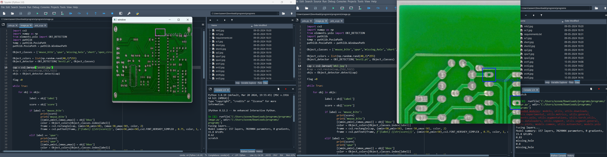

# pcb-defect-detection-using-deep-learning 

This repository contains the implementation of a deep learning model for **Printed Circuit Board (PCB) defect detection** using YOLOv5. The model achieved **89% accuracy**, effectively identifying defects to enhance the quality control process in PCB manufacturing.  

## Overview  

Printed Circuit Boards are critical components in electronic devices.Multi-stage detectors, which have a lengthy processing time and a slower detection speed, are the conventional way for identifying defects on PCB boards. Thus, the Yolo is a single-stage detector with a quick detection speed and minimal processing time. This project leverages YOLOv5, a state-of-the-art object detection model, to automate defect detection in PCBs.

## Features  
- Trained on a dataset of PCB images with labeled defects.  
- Achieved 89% detection accuracy.   
- Supports real-time defect detection.  

## Results  
  

## Tools and Technologies  
- **Deep Learning Framework**: YOLOv5  
- **Programming Language**: Python  
- **Libraries**: PyTorch, OpenCV, Matplotlib  

## Project Workflow  
1. Data Collection 
2. Model Training using YOLOv5  
3. Model Evaluation and Optimization  
4. Real-time Testing and Visualization  

## Data set
I utilized two datasets for this research. dataset link provided below
https://www.kaggle.com/datasets/norbertelter/pcb-defect-dataset
https://universe.roboflow.com/pcb-defect/scratch-2-zsdic/browse?queryText=&pageSize=50&startingIndex=0&browseQuery=true
